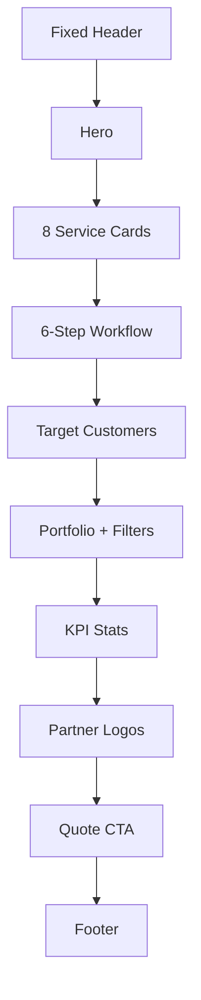
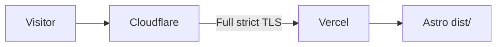

# System D Electrical — Project Plan

## Current State

The repo is a greenfield Git project at [https://github.com/jinwaratt/SystemDElectric.git](https://github.com/jinwaratt/SystemDElectric.git). Working files today:

- [spec.md](spec.md) — product/infra/handoff requirements
- [stitch_system_d_electrical_industrial_website/DESIGN.md](stitch_system_d_electrical_industrial_website/DESIGN.md) — tokens (colors, type, spacing, elevation)
- [stitch_system_d_electrical_industrial_website/code.html](stitch_system_d_electrical_industrial_website/code.html) — complete Thai long-scroll landing page (Tailwind CDN + Material Symbols + Inter)

There is no app yet. Stitch HTML is a **design canvas**, not production code: it hard-codes `width: 1280px`, hides overflow/scrollbars, uses CDN Tailwind, and hotlinks Google AIDA images that will expire.

## 1. Tech Stack Recommendation

**Use Astro (static) + Tailwind CSS + TypeScript.**

Why this fits better than Vite+React or Next.js for this job:

- The page is almost entirely static marketing content. Astro ships **zero JS by default**, so the scroll experience stays fast on mobile.
- Official Tailwind integration maps 1:1 to the Stitch tokens (`primary`, `secondary-container`, `gutter`, `headline-xl`, etc.).
- Vercel detects Astro automatically; no SSR adapter needed for a static landing page.
- Portfolio filter tabs are the only interactive bit — one tiny client island, not a React SPA.
- Handoff is simple: `npm install && npm run dev` for a future developer, plus a prebuilt `dist/` folder.

Reject Next.js (SSR/runtime overhead for one page) and Vite+React (unnecessary JS bundle). Keep the Stitch folder in the repo as the visual source of truth, but do not serve it.

## 2. Site Map (from `code.html`)

Single route `/` with in-page anchors. Skip empty **Section 4**.



Nav targets: `#home`, `#services`, `#projects`, `#about`, `#contact`. Header already has Thai labels; wire them to those IDs. Add a **mobile drawer** (design hides nav below `xl` with no hamburger).

Copy and placeholders from the mock stay unless you provide real data: phone `02-XXX-XXXX`, LINE `@systemelectrical`, email `contact@systemelectrical.co.th`, Ayutthaya address, 2025 copyright.

## 3. Step-by-Step Development Plan

### A. Scaffold

In the repo root (keep `spec.md` and the Stitch folder):

- `npm create astro@latest` — empty / minimal template, TypeScript, no extra frameworks
- `npx astro add tailwind`
- `npx astro add sitemap`
- `.gitignore` for `node_modules`, `dist`, `.env`
- Map DESIGN.md tokens into Tailwind theme (`colors`, `fontSize`, `spacing`, `borderRadius`)
- Load **Inter** + a Thai-capable fallback (`Noto Sans Thai`) so Thai body copy renders correctly
- Load Material Symbols Outlined locally or via Google Fonts (same icon names as the mock)

Proposed layout:

```
src/
  layouts/Layout.astro
  components/
    Header.astro, Hero.astro, Services.astro, Process.astro
    Audience.astro, Portfolio.astro, Stats.astro, Brands.astro
    Cta.astro, Footer.astro
  pages/index.astro
  styles/global.css
public/images/   ← local copies of logo + section photos
```

### B. Pixel-faithful conversion

Port each Stitch section into an Astro component. Match class names, grid, hover, and copy. Production fixes on top of the mock:

- Remove canvas constraints (`overflow: hidden`, fixed 1280×4401, hidden scrollbars)
- Semantic landmarks, skip link, `lang="th"`
- Smooth-scroll header offset (`scroll-margin-top` under the 80px bar)
- Responsive headlines using `headline-xl-mobile` / `headline-lg-mobile` from DESIGN.md
- SEO in `Layout.astro`: title, description, Open Graph, favicon
- Download Stitch images into `public/images/` so the site does not depend on `lh3.googleusercontent.com` AIDA URLs
- Portfolio filters: small `client:load` script to show/hide cards by category (`ทั้งหมด` / `โรงงาน` / `อาคารสูง` / `สถานีไฟฟ้า`)
- Header phone/LINE stay as `tel:` / LINE links (the “quotation form” in the mock is a CTA, not a form — keep it that way)

### C. Polish and verify

- Lighthouse-oriented pass: compressed images, font `display=swap`, no unused JS
- Check desktop (~1280) against the mock and mobile (~375) for stacked grids, header, and CTAs
- Confirm every nav item, `tel:` CTA, and LINE link works end-to-end

### D. Internal Git (not for the client)

Push to the existing GitHub remote for Vercel CI. Do not transfer the GitHub org to the client.

## 4. Infrastructure Guide (Vercel + Cloudflare)

Accounts all live on the dedicated project Gmail (created later). Sequence:

1. **Vercel (free):** Import `jinwaratt/SystemDElectric`, framework Astro, output `dist`, Node 22. Deploy on every `main` push. Confirm `*.vercel.app` works first.
2. **Cloudflare (free):** Add the future domain. Keep nameservers on Cloudflare. Do **not** change Vercel’s generated URL.
3. **SSL to avoid redirect loops** (this is the usual Cloudflare+Vercel failure):
   - Cloudflare SSL/TLS mode: **Full (strict)** — never Flexible (Flexible causes HTTPS loops with Vercel)
   - Vercel: add the apex + `www`, let Vercel issue the cert
   - Cloudflare DNS: `A`/`CNAME` to Vercel targets with **Proxied** (orange cloud)
   - Optional: Cloudflare Always Use HTTPS **on**; disable Cloudflare “Automatic HTTPS Rewrites” if a loop still appears
   - Apex vs www: pick one canonical host; 301 the other in Cloudflare or Vercel (not both)
4. **After domain purchase:** point nameservers to Cloudflare → wait for NS → add records → attach domain in Vercel → wait for cert → test HTTP→HTTPS and www/apex.

No Cloudflare Pages in this setup. Cloudflare is DNS/CDN/proxy only; Vercel is origin.



## 5. Handoff Packaging Guide

Goal: one zip the client can archive; a later developer can rebuild without GitHub.

**Clean before zip:**

- Delete `node_modules`, `.astro`, `.vercel`, `.env*`
- Keep `dist/` (last production build) **and** full source
- Keep `stitch_system_d_electrical_industrial_website/` as design reference
- Do **not** include Git history, Vercel tokens, or the dedicated Gmail password inside the zip (credentials go in a separate, offline note)

**Suggested zip layout:**

```
SystemDElectric-handoff/
  README.md              ← how to run, deploy, who owns accounts
  source/                ← project root minus node_modules
  dist/                  ← prebuilt static site
  design/                ← copy of the Stitch folder
```

`README.md` should say: install Node 22 LTS → `npm install` → `npm run dev` / `npm run build`. Live site is already on Vercel; ownership is the Gmail login (Vercel + Cloudflare + domain).

**Ownership transfer:** give the client the Gmail username/password (and 2FA recovery codes). That is the entire infra handoff. Zip is safekeeping only.

## Out of Scope for v1

- Real contact form / CMS / blog
- Filling empty Stitch Section 4
- Replacing placeholder phone/email until you provide finals
- GitHub org transfer to the client
